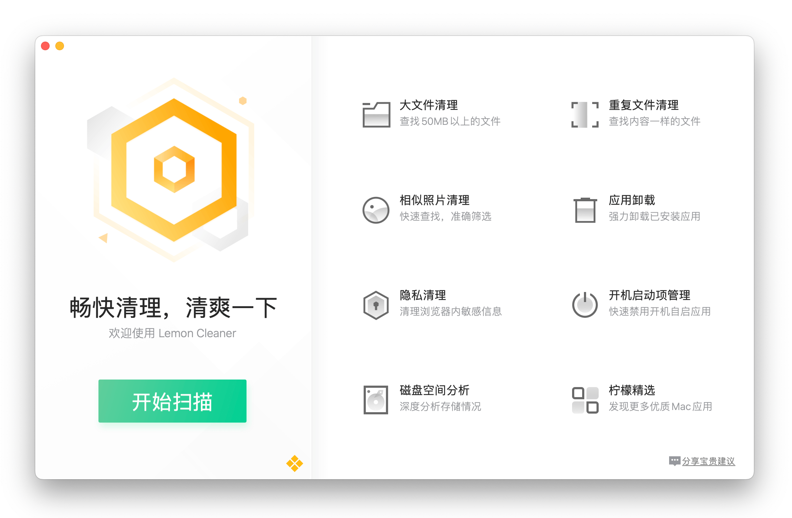

## Lemon 修改版

## RoadMap
- [x] 20240828 添加扫描 unity 工程的功能
- [x] 20240830 添加 python 运行时环境, 实现动态添加扫描逻辑
    * 扫描类型添加 python, 即可用 python 来进行扫描
    * python 运行时是自行编译放进来的
    * python 脚本目前是 hard-code 在代码中的
- [x] 20240806 添加配置文件 `$HOME/.lemon/config.json`
    ```json
    {
        "garbage": "garbage config file(e.g. garbage.xml)",
        "pythonHome": "Python lib path(e.g. ~/Python-3.12.5)",
        "pythonEntry": "Python scan entry script(e.g. py_entry.py)"
    }
    ```
- [x] 20241029
    - [x] bugfix: 修复 python 脚本扫描 import 需要在函数一级进行 import 的问题
    - [x] bugfix: 修复 python 脚本扫描可能会导致中途失败的问题
    - [x] 支持往 python 脚本传递参数, 扫描结果回传通过文件进行(文件路径通过参数传递给 python 脚本)
        * 增加配置项 `scanResultFile`, 表示扫描保存结果
- [x] 20241211
    - [x] feature: pass action config fileds to python entry script

- [x] 20250407
    - [x] bugfix: fix `os.popen` error with python scripts by submit related *.so
        * notice: need to append its path to sys.path to take effect and resign *.so with codesign tool

##

# 以下是原仓库 README.md


## 项目简介
针对中国用户习惯性清理的特点，打造了腾讯柠檬清理，系统性解决macOS设备空间问题。重点聚焦清理功能，对上百款软件提供定制化的清理方案，提供专业的清理建议，帮助用户轻松完成一键式的清理。另外还提供相似照片清理、大文件清理、隐私清理、应用卸载和开机启动项保护等功能，帮助用户多维度的管理自己的电脑。整体设计上清新简洁，状态栏小巧好用，是一款Mac设备必备的实用工具。



## 功能亮点

1. 深度扫描清理：针对Xcode、Sketch等常见应用逐一定制扫描方案，精准分析应用文件，分类通俗易懂，随时保持Mac干净清爽。
2. 大文件清理：全面查找占用超过50M的大文件，揪出磁盘元凶，支持自定义扫描文件夹。
3. 重复文件清理：智能比对重复内容，腾出磁盘空间，支持自定义扫描文件夹。
4. 相似照片清理：整理相册好帮手，极速筛选相似照片，支持自定义扫描文件夹。
5. 浏览器隐私清理：保护浏览器隐私，防止恶意窃取，支持Safari/Chrome等多款浏览器。
6. 应用卸载：清理应用更干净，不怕卸载有残留。
7. 开启启动项管理：管理应用开机自启动，运行环境更舒适。
8. 自定义状态栏展示信息：支持自定义在状态栏实时显示内存占用、磁盘空间、CPU温度、风扇转速、网速等信息。
9. 更多功能等你来探索！


## 技术模块
- Lemon：主工程。
- LemonMonitor：状态栏。
- LemonBigOldFile：用于大文件清理。
- LemonDuplicateFile：用于重复文件清理。
- LemonPhotoClean：用于相似照片清理。
- LemonUninstaller：用于应用卸载。
- LemonPrivacyClean：用于隐私清理。
- LemonLoginItemManager：用于开机启动管理。
- LemonSpaceAnalyse：用于磁盘空间分析。
- LemonFileMove：用于文件搬家。
- LemonHardware：用于硬件信息获取。
- LemonNetSpeed：用于网络测速。
- LemonCleaner：用于实际清理操作。


## 贡献
### Issue
如果您发现新的Bug、想要新功能或提出建议，您可以在GitHub上Issue，请按照Issue模板中的准则进行操作。提交问题之前，请确保满足以下条件：

- 必须是错误或新功能。
- 已在问题中不存在类似的问题或解决方案。
- 创建新问题时，请提供详细说明。

### Pull Requests
欢迎大家贡献代码，代码团队将监控所有pull请求，我们将进行相应的代码检查和测试。请在完成PR之前确认以下几点：

- 请在修改代码后修改相应的文档和注释
- 请在新创建的文件中添加许可证和版权声明。
- 进行充分的测试。
- 请遵循相关的代码编写规范。


## License
Lemon Cleaner uses 2 different licenses :

- the files in the LemonDaemon module use a GPL v2 license
- all other files in the Lemon Monitor and Lemon Cleaner use a GPL v3 license, unless explicitly stated otherwise

The files in LemonDaemon module is licensed under the GNU General Public License, version 2 except for the third-party components as listed in the license text for LemonDaemon.

The files in modules Lemon Monitor and Lemon Cleaner are licensed under the GNU General Public License, version 3 except for the third-party components as listed in the license text for Lemon Monitor and Lemon Cleaner.


## 官网
[腾讯柠檬清理](https://lemon.qq.com)

